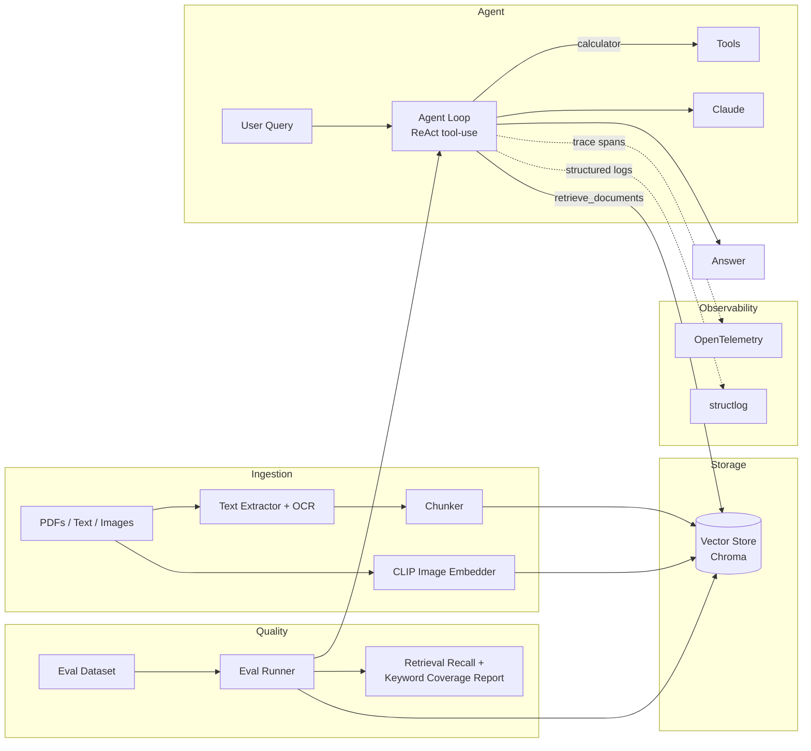

# Sentinel

Autonomous multimodal RAG agent — with retrieval evals, tracing, and CI/CD baked in from
the start, not bolted on after a demo worked.

Sentinel ingests PDFs, plain text, and images into a shared vector space (text via
sentence-transformers, images via CLIP so a screenshot with zero OCR-able text is still
retrievable by meaning), then answers questions through a tool-calling agent loop that
decides when to search the knowledge base versus when it already knows the answer.

## Why this exists

Most RAG demos stop at "it answers questions." Sentinel exists to show the parts that
actually matter in production: does retrieval work well enough to trust (evals), can you
see what the agent did and why (tracing), and does it ship (CI + Docker)?

## Architecture



## Features

- **Multimodal ingestion** — PDFs (PyMuPDF), plain text, and images (CLIP embeddings +
  best-effort OCR), chunked with configurable overlap.
- **Hybrid retrieval** — text and image vectors live in the same Chroma-backed store and
  are queried together for a single question.
- **Tool-calling agent loop** — a small, dependency-light ReAct implementation on top of
  the Anthropic API; tools are plain functions paired with their schema so they can't
  drift out of sync.
- **Evals as a first-class citizen** — retrieval recall@k and answer keyword coverage,
  run against a fixture dataset in CI on every PR.
- **Observability** — OpenTelemetry tracing around every agent step and tool call,
  structured JSON logs via structlog.
- **Ships** — Dockerfile, docker-compose, and a GitHub Actions pipeline (lint, type
  check, test, build) rather than a bare `python main.py`.

## Quickstart

```bash
pip install -e ".[dev]"
export ANTHROPIC_API_KEY=sk-...

sentinel ingest ./data
sentinel query "What's in the knowledge base?"
sentinel eval tests/fixtures/eval_dataset.json --report eval_report.json
sentinel serve   # FastAPI on :8000
```

Or via Docker:

```bash
docker compose up --build
```

## Project layout

```
src/sentinel/
  ingestion/      text + image extraction, chunking, ingestion pipeline
  retrieval/      Chroma vector store wrapper, hybrid retriever
  agent/          LLM client seam, tool definitions, ReAct loop
  eval/           eval dataset loader, metrics, runner
  observability/  tracing + structured logging
  api/            FastAPI service
  cli.py          typer CLI entrypoint
tests/            unit tests for chunking, tools, and eval metrics
```

## Design notes

- The vector store and LLM client are both accessed through thin wrapper classes rather
  than called directly from business logic, so either can be swapped (e.g. Chroma →
  Qdrant, Anthropic → a local model) without touching the agent loop or ingestion code.
- Eval metrics are heuristic (substring/keyword-based) by default so the suite runs
  deterministically in CI without needing an API key or incurring LLM cost on every push.
- The calculator tool evaluates expressions via an AST whitelist, not `eval()`.

## Roadmap

- [ ] LLM-as-judge eval mode for answer quality beyond keyword coverage
- [ ] Streaming responses over the FastAPI endpoint
- [ ] Swap-in adapter for a local model backend (Ollama) for offline demos

## License

MIT
